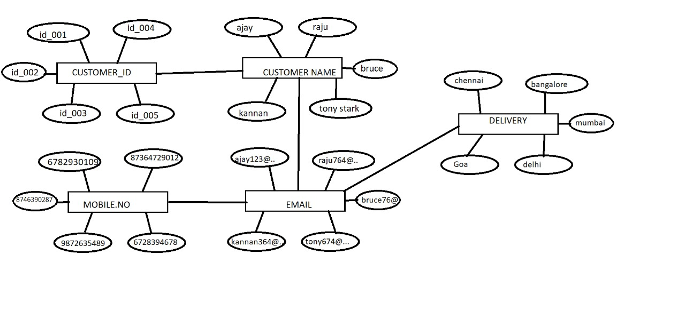
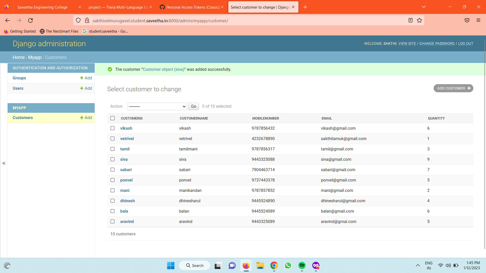

# Django ORM Web Application

## AIM
To develop a Django application to store and retrieve data from a database using Object Relational Mapping(ORM).

## Entity Relationship Diagram


## DESIGN STEPS

### STEP 1:
create and collect the information from using django applications.

### STEP 2:
Implement that as python code

### STEP 3:
Push that python code to github

Write your own steps

## PROGRAM
```
from django.db import models

# Create your models here. 
from django.db import models
from django.contrib import admin
# Create your models here.
class Customer(models.Model):
    class Meta():
        permissions= (("views_labs","can view lab details."),
        ("view_marks","view semester marks"))
    customerid = models.CharField(max_length=8,primary_key=True)
    customername =models.CharField(max_length=100)
    mobilenumber =models.CharField(max_length=100)
    email = models.EmailField()
    quantity= models.IntegerField()
    

class CustomerAdmin(admin.ModelAdmin):
    list_display = ('customerid','customername','mobilenumber','email','quantity') 
```


## OUTPUT




## RESULT
Thus the experiment was executed successfully.
